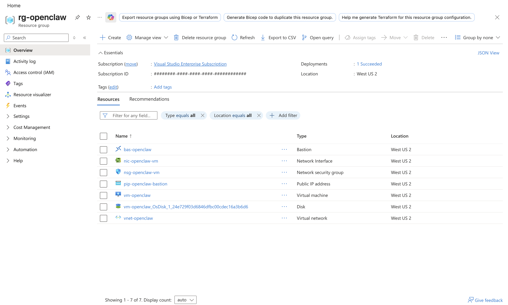

# OpenClaw on Azure Linux VM with Native GitHub Copilot Provider

Deploy OpenClaw with the native GitHub Copilot provider (`github-copilot`) on a single Azure Linux VM using Azure Resource Manager (ARM) templates, with Azure Bastion-first administration and Azure Bastion SSH key-based access.

This implementation is designed for enterprise Azure environments that typically require:

1. Controlled admin access paths to VM via Azure Bastion SSH.
2. Network Security Group (NSG) rules that block SSH from the public Internet.
3. Repeatable infrastructure deployment via ARM.
4. Operationally simple single-VM rollout before scaling complexity.

## Architecture

1. A single Azure resource group containing all resources.
2. Network:
   - VNet + VM subnet.
   - Azure Bastion Standard host with native client tunneling enabled + Azure Bastion subnet.
   - Network Security Group (NSG) policy:
     - deny SSH from Internet
     - deny SSH from VirtualNetwork
     - allow SSH from Azure Bastion subnet only
3. Compute: Ubuntu LTS VM.
4. Storage: Managed OS disk.
5. Access pattern:
   - VM admin via Azure Bastion SSH.

## Repository Contents

1. `infra/azuredeploy.json` - ARM template.
2. `infra/azuredeploy.parameters.json` - deployment parameters.
3. `scripts/bootstrap-openclaw.sh` - bootstrap script to install OpenClaw.

## Prerequisites

### Required Tools and Access

1. Azure CLI installed. See [Azure CLI install steps](https://learn.microsoft.com/cli/azure/install-azure-cli) if needed.
2. SSH public key available at `~/.ssh/id_ed25519.pub`. To generate one, run the `ssh-keygen -t ed25519 -a 100 -f ~/.ssh/id_ed25519 -C "yourname@company"` command.

### Azure Login

```bash
az login
az account show -o table
```

### Azure CLI SSH Extension

```bash
az extension add -n ssh
```

### Azure Resource Provider Registration

```bash
az provider register --namespace Microsoft.Compute
az provider register --namespace Microsoft.Network

az provider show --namespace Microsoft.Compute --query registrationState -o tsv
az provider show --namespace Microsoft.Network --query registrationState -o tsv
```

## Deploy Azure Resources

### Set Azure Deployment Variables

```bash
RG="rg-openclaw"
LOCATION="westus2"
TEMPLATE_URI="https://raw.githubusercontent.com/johnsonshi/openclaw-azure-github-copilot/main/infra/azuredeploy.json"
PARAMS_URI="https://raw.githubusercontent.com/johnsonshi/openclaw-azure-github-copilot/main/infra/azuredeploy.parameters.json"
SSH_PUB_KEY="$(cat ~/.ssh/id_ed25519.pub)"
```

> [!IMPORTANT]
> `infra/azuredeploy.parameters.json` intentionally keeps `sshPublicKey` as a placeholder. Always pass your real key at deploy time (when running `az deployment` commands) using `--parameters sshPublicKey="${SSH_PUB_KEY}"`.

### Create Azure Resource Group

```bash
az group create -n "${RG}" -l "${LOCATION}"
```

### Preview Azure Deployment

```bash
az deployment group validate \
  -g "${RG}" \
  --template-uri "${TEMPLATE_URI}" \
  --parameters "${PARAMS_URI}" \
  --parameters sshPublicKey="${SSH_PUB_KEY}"

az deployment group what-if \
  -g "${RG}" \
  --template-uri "${TEMPLATE_URI}" \
  --parameters "${PARAMS_URI}" \
  --parameters sshPublicKey="${SSH_PUB_KEY}"
```

### Create Azure Deployment

```bash
az deployment group create \
  -g "${RG}" \
  --template-uri "${TEMPLATE_URI}" \
  --parameters "${PARAMS_URI}" \
  --parameters sshPublicKey="${SSH_PUB_KEY}"
```

> [!NOTE]
> You can override any template parameter in the CLI command.

```bash
az deployment group create \
  -g "${RG}" \
  --template-uri "${TEMPLATE_URI}" \
  --parameters location="${LOCATION}" \
  --parameters vmName="vm-openclaw" \
  --parameters vmSize="Standard_B2as_v2" \
  --parameters adminUsername="openclaw" \
  --parameters sshPublicKey="${SSH_PUB_KEY}" \
  --parameters vnetName="vnet-openclaw" \
  --parameters vnetAddressPrefix="10.40.0.0/16" \
  --parameters vmSubnetName="snet-openclaw-vm" \
  --parameters vmSubnetPrefix="10.40.2.0/24" \
  --parameters bastionSubnetPrefix="10.40.1.0/26" \
  --parameters nsgName="nsg-openclaw-vm" \
  --parameters nicName="nic-openclaw-vm" \
  --parameters bastionName="bas-openclaw" \
  --parameters bastionPublicIpName="pip-openclaw-bastion" \
  --parameters osDiskSizeGb=64
```

### Validate Azure Deployment in Azure Portal

After deployment completes, you can verify the expected resources in the resource group overview in the Azure Portal.



## Setup OpenClaw on Azure VM

### Set Post-Deployment Variables

```bash
RG="rg-openclaw"
VM_NAME="vm-openclaw"
BASTION_NAME="bas-openclaw"
ADMIN_USERNAME="openclaw"
VM_ID="$(az vm show -g "${RG}" -n "${VM_NAME}" --query id -o tsv)"
```

### Install OpenClaw on the VM

Run host provisioning first from local shell to install OpenClaw on the VM (no interactive Azure Bastion session required):

```bash
az vm run-command invoke \
  -g "${RG}" \
  -n "${VM_NAME}" \
  --command-id RunShellScript \
  --scripts "curl -fsSL https://raw.githubusercontent.com/johnsonshi/openclaw-azure-github-copilot/main/scripts/bootstrap-openclaw.sh | bash"
```

### Connect to VM Through Azure Bastion (SSH)

Create an Azure Bastion SSH session for use in configuring OpenClaw:

```bash
az network bastion ssh \
  --name "${BASTION_NAME}" \
  --resource-group "${RG}" \
  --target-resource-id "${VM_ID}" \
  --auth-type ssh-key \
  --username "${ADMIN_USERNAME}" \
  --ssh-key ~/.ssh/id_ed25519
```

### OpenClaw Configuration (Provider / Model)

Configure OpenClaw in the **same Azure Bastion SSH VM shell** by running the onboarding flow:

```bash
openclaw onboard --install-daemon
```

In the onboarding wizard, use:

1. Continue security prompt: `Yes`
2. Onboarding mode: `QuickStart`
3. Model/auth provider: `Copilot`
4. Copilot auth method: `GitHub Copilot (GitHub device login)`

QuickStart selections expected:

1. Gateway port: `18789`
2. Gateway bind: `Loopback (127.0.0.1)`
3. Gateway auth: `Token (default)`
4. Tailscale exposure: `Off`
5. Channel mode: `Direct to chat channels`

After selecting Copilot device login, OpenClaw will print a device code and prompt you to authorize at `https://github.com/login/device`.
Keep the VM shell open while completing device authorization.

Expected auth completion output:

1. `GitHub access token acquired`
2. `Updated ~/.openclaw/openclaw.json`
3. `Auth profile: github-copilot:github (github-copilot/token)`

Expected model selection behavior:

1. OpenClaw sets an initial default model (for example: `github-copilot/gpt-4o`).
2. At `Default model`, choose `Keep current (github-copilot/gpt-4o)` or select another model from the wizard list.
3. If your Copilot plan does not allow the selected model, choose a different option from the same wizard menu.

Follow the rest of the OpenClaw onboarding steps, such as onboarding it to a messaging app so you can chat with it on the go (recommended: [Telegram onboarding](https://docs.openclaw.ai/channels/telegram)), giving it search APIs, and installing skills.

### OpenClaw Runtime Validation

After setting up OpenClaw, you can run the following in the **same Azure Bastion SSH VM shell** to verify the setup:

```bash
openclaw --version
openclaw gateway status
openclaw doctor
openclaw logs --limit 200
```

## Operations

Before running the commands in this section, connect to the VM using [Connect to VM Through Azure Bastion (SSH)](#connect-to-vm-through-azure-bastion-ssh).

### VM OS Patching

```bash
sudo apt-get update
sudo apt-get upgrade -y
sudo reboot
```

### OpenClaw Service Operations

```bash
openclaw gateway status
openclaw gateway restart
openclaw logs --follow
```

### OpenClaw Upgrade / Rollback

```bash
sudo npm install -g openclaw@<target-version>
# rollback:
sudo npm install -g openclaw@<previous-known-good-version>
openclaw gateway restart
```

### OpenClaw Model Management

Run these in the **same Azure Bastion SSH VM shell** when you want to re-authenticate or change models.

#### Re-authenticate GitHub Copilot

```bash
openclaw models auth login-github-copilot
```

#### List Available Models

```bash
openclaw models list
```

#### Change Default Model

```bash
openclaw models set github-copilot/<model-id>
```

Examples:

1. `openclaw models set github-copilot/gpt-4o`
2. `openclaw models set github-copilot/gpt-5.4`

If a model is rejected by your Copilot plan, choose another from `openclaw models list`.

For more information on, please check out the [OpenClaw docs on the GitHub Copilot model provider](https://docs.openclaw.ai/providers/github-copilot).
